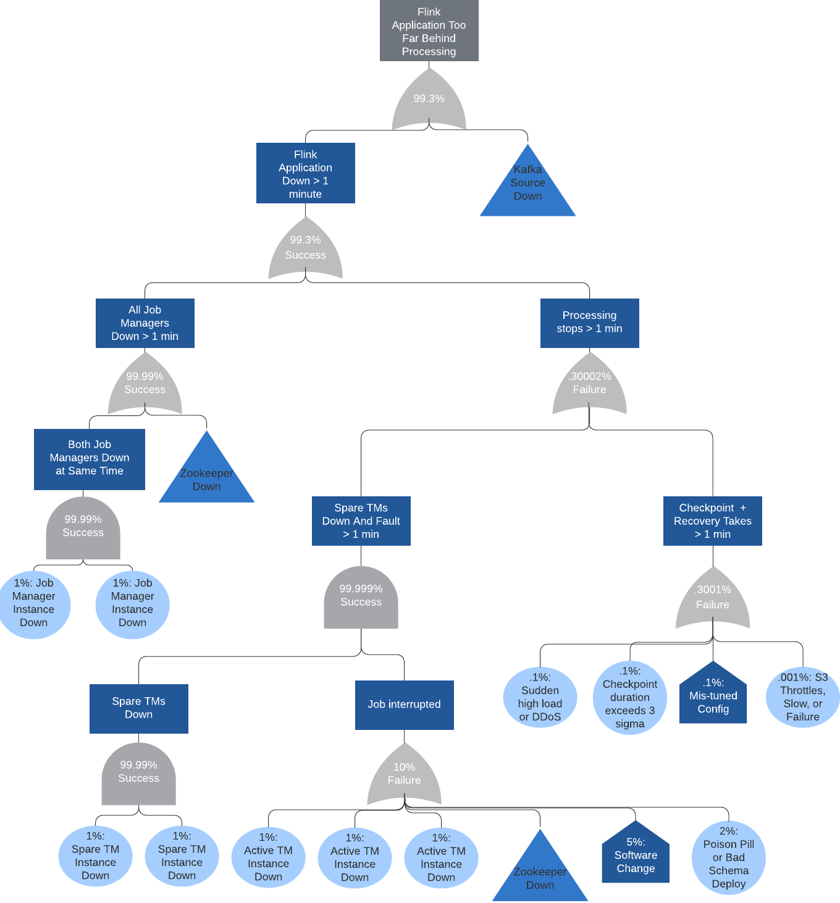
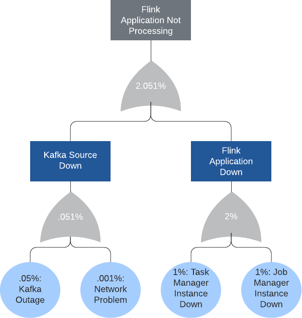

# Fault Tree Analysis Applied to Apache Flink

This repository contains images presented at [Flink Forward Global 2021](https://www.flink-forward.org/global-2021/conference-program#fault-tree-analysis-applied-to-apache-flink). 
A link to the conference recording will be added here once it is available.

## Final redefined Fault Tree for Flink
This is the final resulting diagram that we came up with after all of our iterations:

## Stateless Web Service
These are the diagrams we used in the warmup exercise:

With 10 nodes:\

With load balancer:\

## Treatment of Flink as a Web App
These are diagrams where we treated Flink as if it were a web app to get the basics worked out.

Multiple task managers and zookeepers:\

Additional task managers:\

## FormulasMultiple Flink Task Managers and Zookeepers

Below is the main formula that was featured. You can find other formulas in the main directory of this repository, 
including a variation that for Flink running on Kubernetes.

